# Data durability and recovery

This project is part of the Udacity Cloud Architect Nanodegree.

The goal of this project is to :
- Build a Multi-AvailabilityZone, Multi-Region database and show how to use it in multiple geographically separate AWS regions.  
- Build a website hosting solution that is versioned so that any data destruction and accidents can be quickly and easily undone.

This project was cloned from this repository: https://github.com/udacity/nd063-c2-design-for-availability-resilience-reliability-replacement-project-starter-template

## Project Instructions & Screenshots of achievments
### Cloud formation
In this project, you will use the AWS CloudFormation to create Virtual Private Clouds. CloudFormation is an AWS service that allows you to create "infrastructure as code". This allows you to define the infrastructure you'd like to create in code, just like you do with software. This has the benefits of being able to share your infrastructure in a common language, use source code control systems to version your infrastructure and allows for documenting and reviewing of infrastructure and infrastructure proposed changes.

CloudFormation allows you to use a configuration file written in a YAML file to automate the creation of AWS resources such as VPCs. In this project, you will use a pre-made CloudFormation template to get you started. This will allow you to create some of the infrastructure that you'll need without spending a lot of time learning details that are beyond the scope of this course.

You can find the YAML file in the GitHub repo: https://github.com/udacity/nd063-c2-design-for-availability-resilience-reliability-replacement-project-starter-template/blob/master/cloudformation/vpc.yaml

In order to build a VPC from the YAML file, follow the steps:

1. Services -> CloudFormation
2. Create stack “With new resources (standard)”
3. Template is ready
4. Upload a template file
5. Click “Choose file” button
6. Select provided YAML file
7. Next
8. Fill in Stack name
9. Name the VPC
10. Update the CIDR blocks
11. Click Next
12. Click Next again
13. Click Create stack
14. Wait for the stack to build out.  Refresh until status becomes “CREATE_COMPLETE”
15. Observe the “Outputs” tab for the created IDs.  These will be used later.

Once the CloudFormation Stack has completed, you can look at the "Resources" tab to see all of the AWS resources that the stack has created.  You can see both the type of resources that have been created, as well as the AWS identifiers for those resources so that you can locate these resources in the AWS service that they are a part of.

The "Outputs" tab shows you custom output from the CloudFormation Stack that is labeled and described for you.  These descriptions are custom descriptions that were added to the CloudFormation template and make it easier for you to find specific values that have been created as a part of the CloudFormation stack.  Here, you can find the VPC ID that has been created, the subnet IDs including which subnets are public and which are private, and the Security Groups that have been created and a description of each.

### Part 1
Complete the following steps:
### Data durability and recovery
In order to achieve the highest levels of durability and availability in AWS you must take advantage of multiple AWS regions. 
1. Pick two AWS regions. An active region and a standby region.
2. Use CloudFormation to create one VPC in each region. Name the VPC in the active region "Primary" and name the VPC in the standby region "Secondary".

**NOTE**: Be sure to use different CIDR address ranges for the VPCs.

**Primary VPC:**
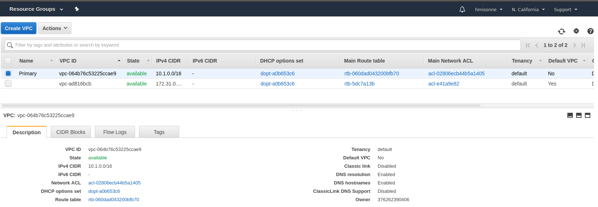

**Secondary VPC:**
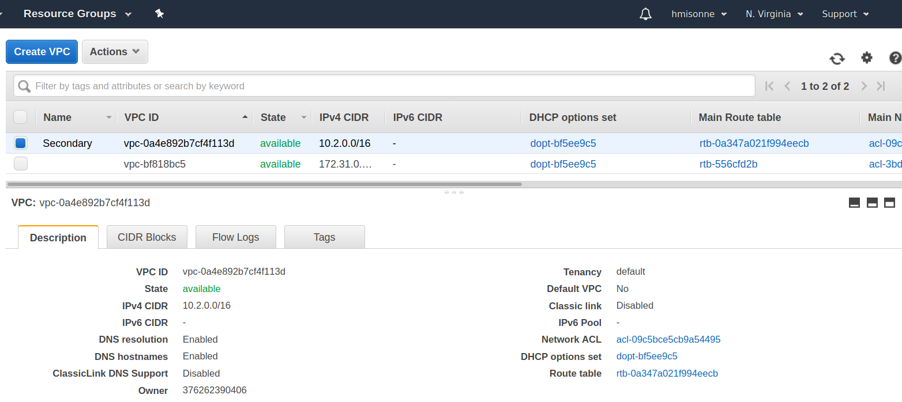

### Highly durable RDS Database
1. Create a new RDS Subnet group in the active and standby region.
2. Create a new MySQL, multi-AZ database in the active region. The database must:
     - Be a “burstable” instance class.
     - Have only the “UDARR-Database” security group.
     - Have an initial database called “udacity.”
3. Create a read replica database in the standby region. This database has the same requirements as the database in the active region. 

**Configuration of the database in the active region:**
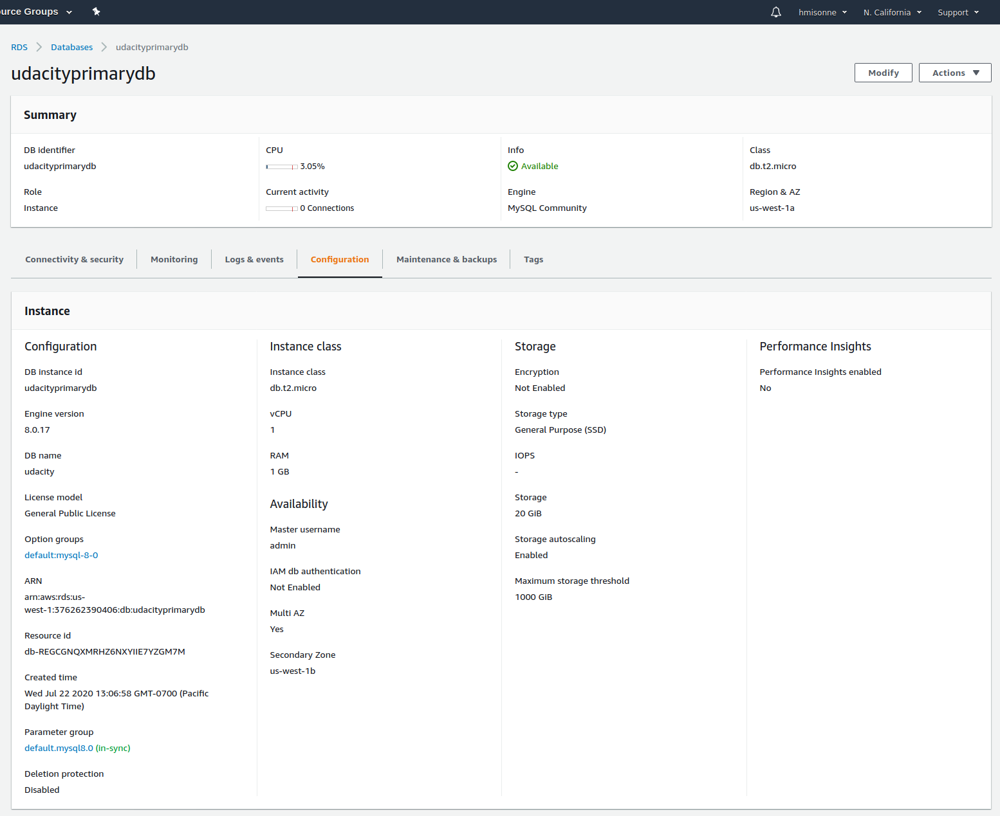

**Configuration of the database in the secondary region:**
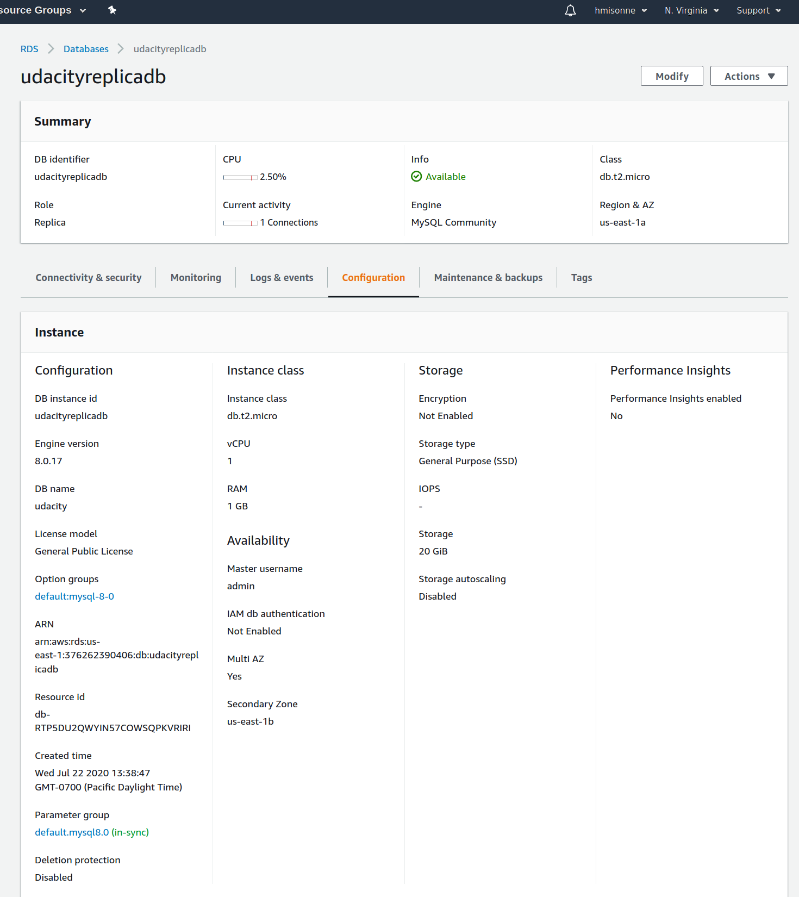

**Subnet groups in the active region:**
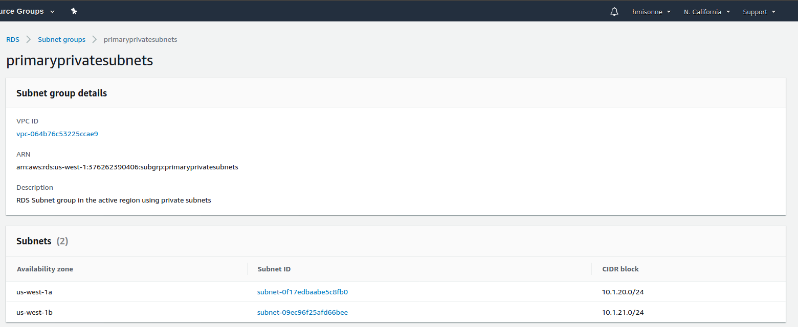

**Subnet groups in the secondary region:**
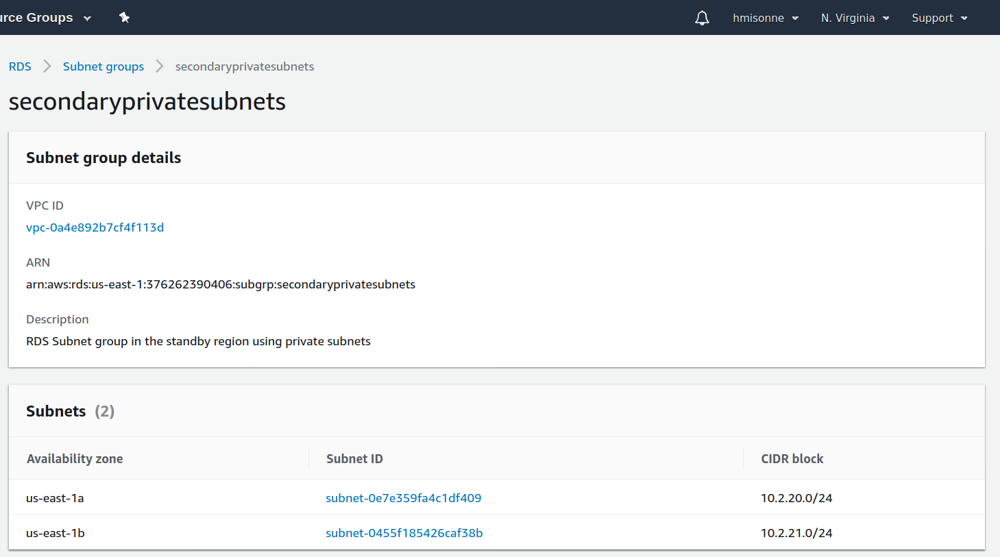

**Route tables in subnet of the active region:**
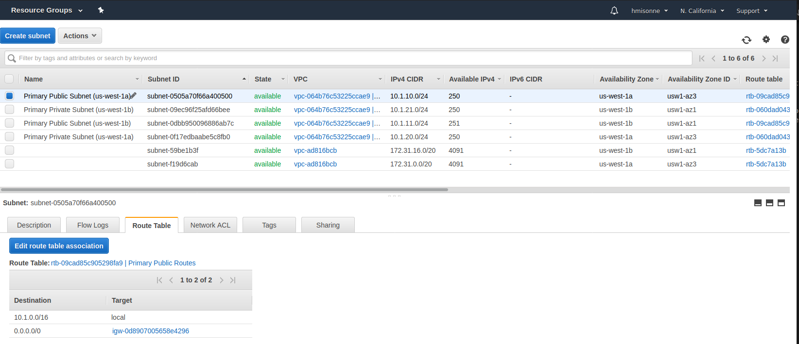

**Route tables in subnet of the active region:**
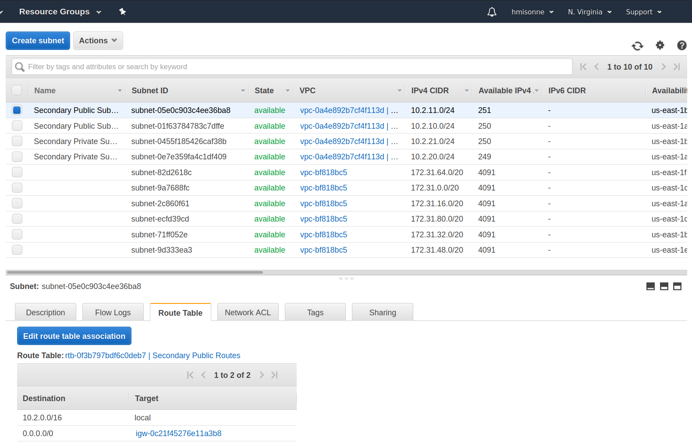

### Estimate availability of this configuration
Write a paragraph or two describing the achievable Recovery Time Objective (RTO) and Recovery Point Objective (RPO) for this Multi-AZ, multi-region database in terms of:

1. Minimum RTO for a single AZ outage 
If a multi-AZ configuration is set up, the fail over to another AZ will happen automatically which can take a few minutes.
    
2. Minimum RTO for a single region outage
     ◦ 00:00 - Problem happens (0 minutes) 
     ◦ 00:05 - An amount of time passes before an alert triggers (5 minutes) 
     ◦ 00:06 - Alert triggers on-all staff (1 minute) 
     ◦ 00:16 - On-call staff may need to get out of bed, get to computer, log in, log onto VPN (10 minutes) 
     ◦ 00:26 - On-call staff starts diagnosing issue (10 minutes) 
     ◦ 00:41 - Root cause is discovered (15 minutes) 
     ◦ 00:46 - Remediation started (5 minutes) :  Promote secondary instance to be the new master and then route the traffic to the new endpoint
     ◦ 00:56 - Remediation completed (10 minutes) 
     Total time: 56 minutes 

3. Minimum RPO for a single AZ outage
As it only takes a few minutes to fail over to another AZ, a few minutes of data will be lost.   
       
    
4. Minimum RPO for a single region outage 
If we set up an RDS database with automatic backups enabled, the RPO will be based on how often data is backed up. If we set up a backup every 4 hours, the minimun RPO will be 4 hours.

### Demonstrate normal usage
In the active region:
1. Create an EC2 keypair in the region
2. Launch an Amazon Linux EC2 instance in the active region. Configure the instance to use the VPC's public subnet and security group ("UDARR-Application"). 
3. SSH to the instance and connect to the "udacity" database in the RDS instance. 
4. Verify that you can create a table, insert data, and read data from the database. 
5. You have now demonstrated that you can read and write to the primary database

Log of connecting to the database, creating the table, writing to and reading from the table:
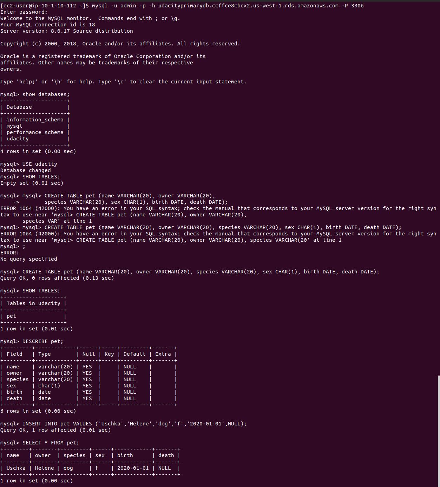

### Monitor database
1. Observe the “DB Connections” to the database and how this metric changes as you connect to the database
2. Observe the “Replication” configuration with your multi-region read replica. 

**DB Connections:**
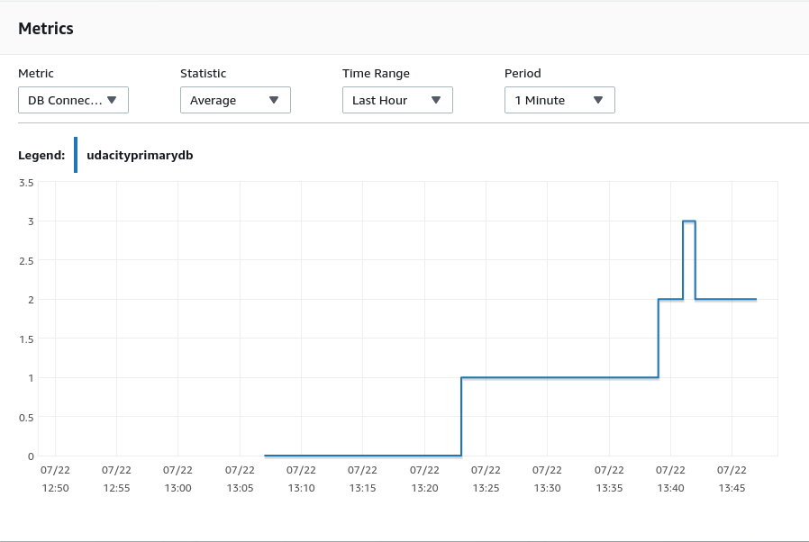

**DB Replication:**
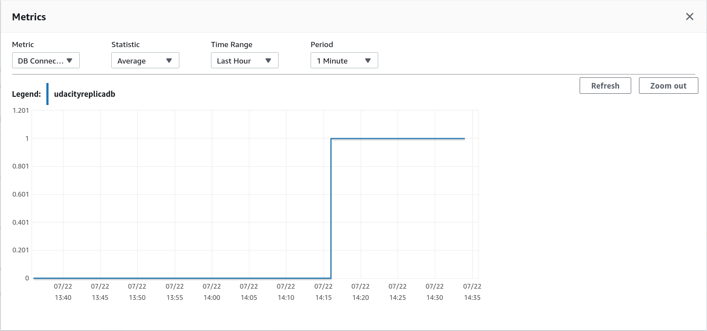

### Part 2
### Failover And Recovery
In the standby region:

1. Create an EC2 keypair in the region
2. Launch an Amazon Linux EC2 instance in the standby region. Configure the instance to use the VPC's public subnet and security group ("UDARR-Application").
3. SSH to the instance and connect to the read replica database.
4. Verify if you are not able to insert data into the database but are able to read from the database.
5. You have now demonstrated that you can only read from the read replica database.

**Log of connecting to the database, writing to and reading from the database before the database promotion:**
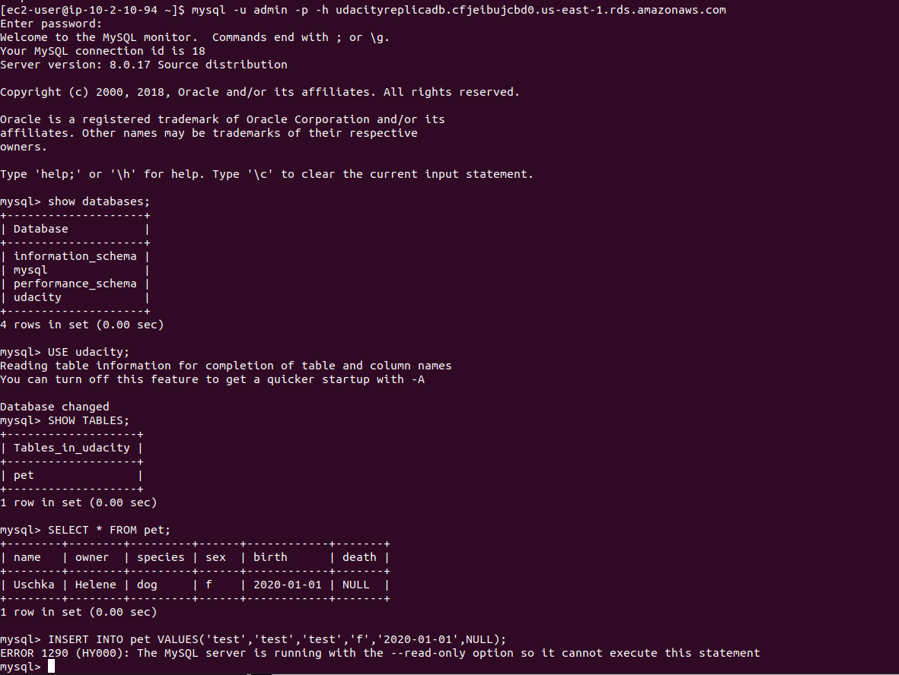

**Database configuration before the database promotion:**

6. Promote the read replica
7. Verify that if you are able to insert data into and read from the read replica database.
8. You have now demonstrated that you can read and write the promoted database in the standby region.

**Log of connecting to the database, writing to and reading from the database after the database promotion:**
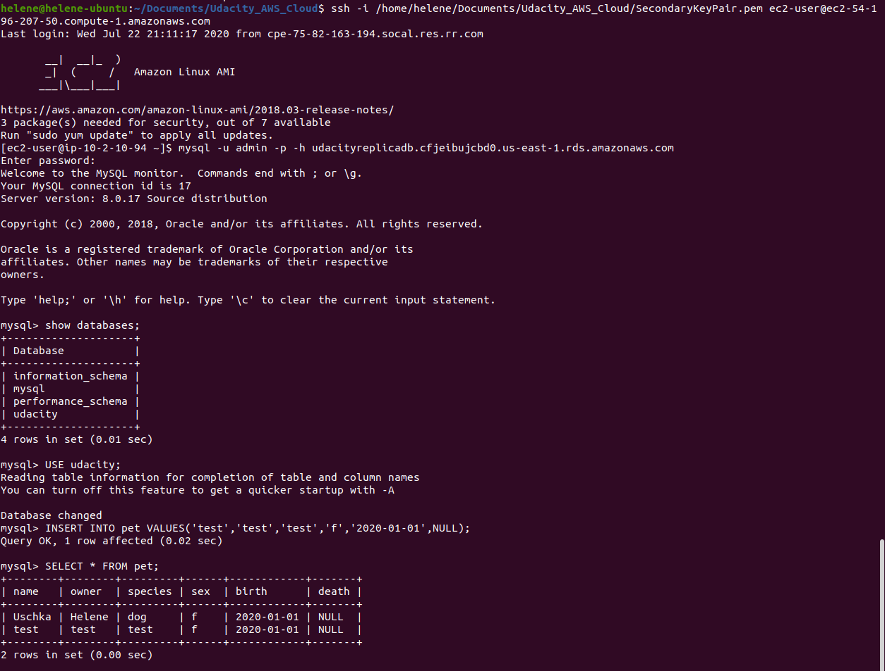

**Database configuration after the database promotion:**
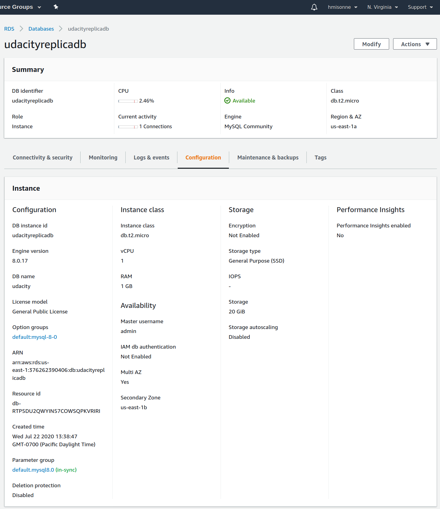

### Part 3
### Website Resiliency

Build a resilient static web hosting solution in AWS. Create a versioned S3 bucket and configure it as a static website.

1. Enter “index.html” for both Index document and Error document
2. Upload the files from the GitHub repo (under `/project/s3/`)
3. Paste URL into a web browser to see your website. 

**Original webpage:**
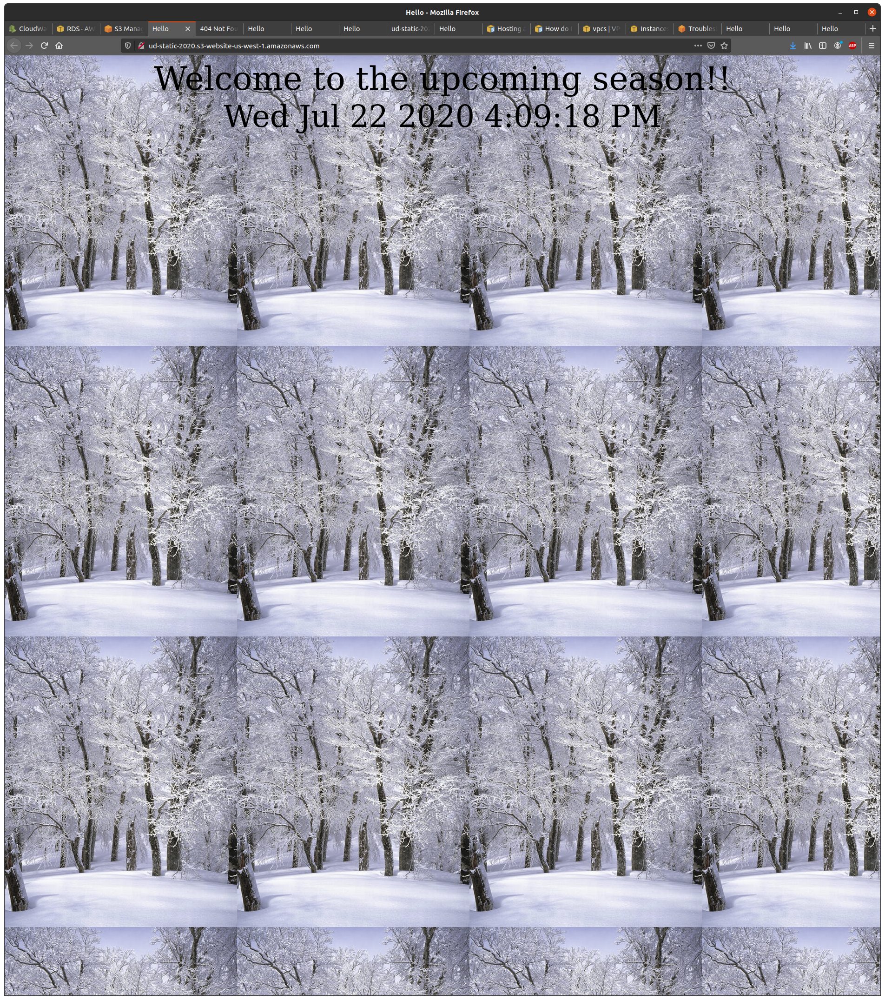

You will now “accidentally” change the contents of the website such that it is no longer serving the correct content

1. Change `index.html` to refer to a different “season”
2. Re-upload `index.html`
3. Refresh web page

**Modified webpage:**
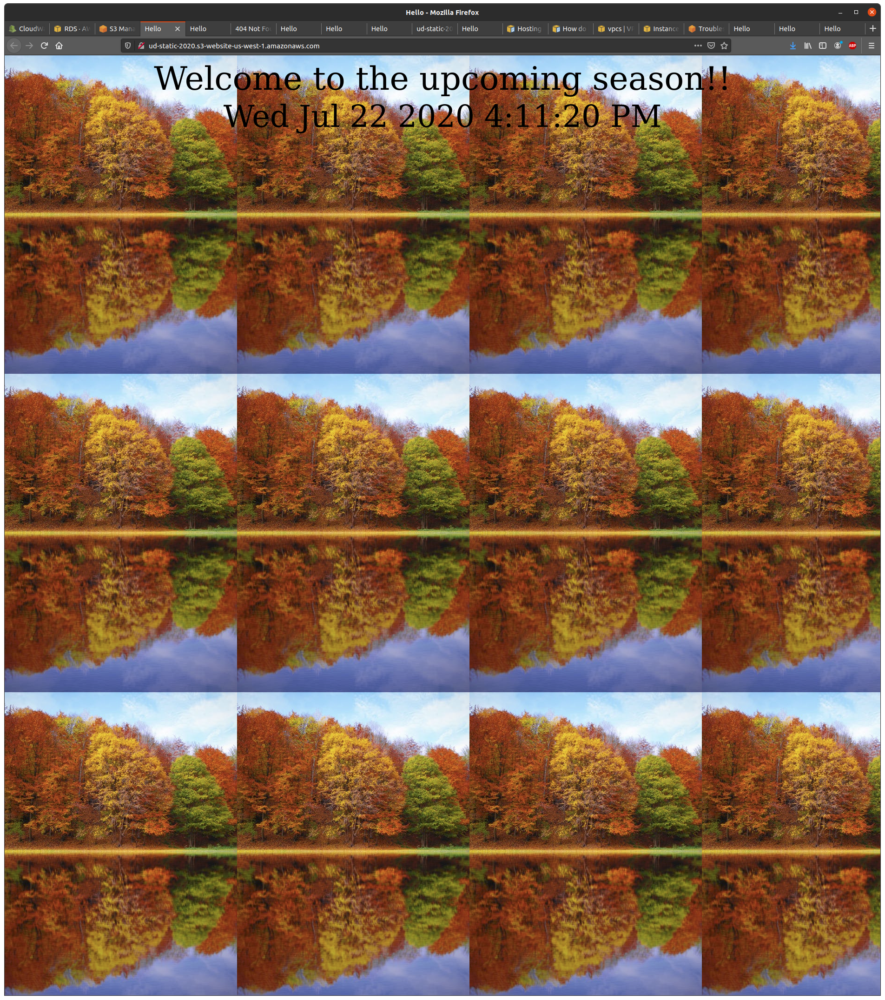

You will now need to “recover” the website by rolling the content back to a previous version.

1. Recover the `index.html` object back to the original version
2. Refresh web page

**Modified webpage (reverted):**
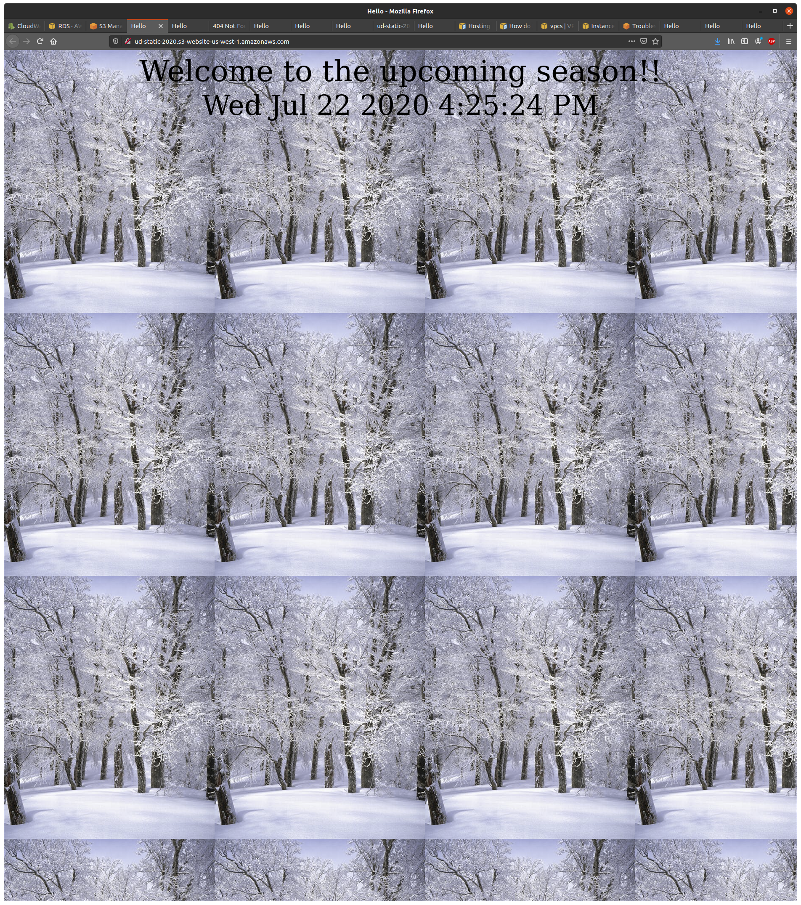

You will now “accidentally” delete contents from the S3 bucket. Delete “winter.jpg”

**Webpage after content deleted:**
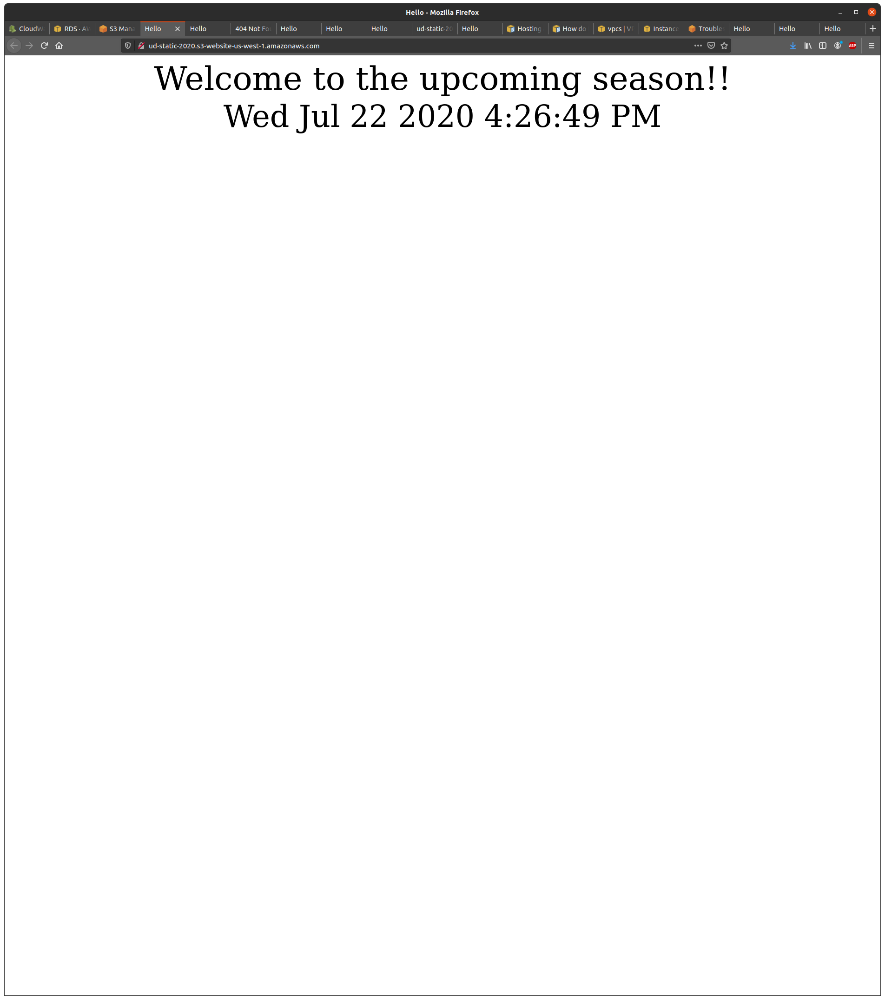

**Existing versions of the file showing the "Deletion marker".**

You will now need to “recover” the object:

1. Recover the deleted object
2. Refresh web page

**Recovered Website:**
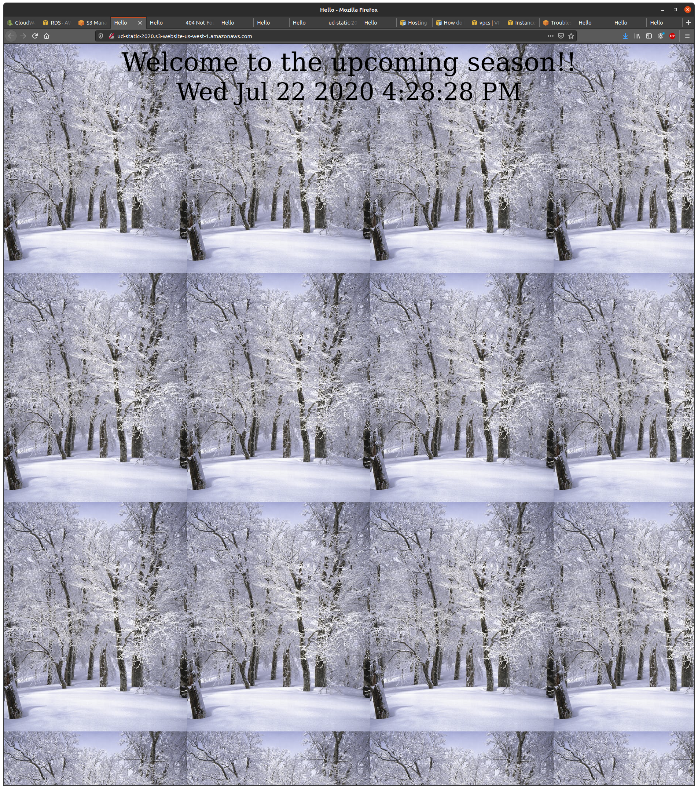

## License
